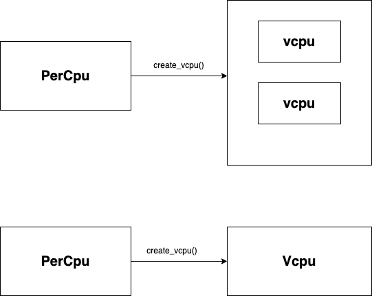

# hypercraft
🚧 WIP 🚧 hypercraft is a VMM library written in Rust. If you are interested in Design & Implement about this project, please see this [discussion](https://github.com/orgs/rcore-os/discussions/13).

## RoadMap
- [x] Vcpu abstract layer(`vcpu_create()`, `vcpu_read()`, `vcpu_write()`, `vcpu_run()`)
- [x] Load & run hello world binary in example.
- [ ] `percpu` Design
- [ ] multi-core support
- [ ] multi-guest switch support(vcpu schedule)
- [ ] GuestPageTable, GuestMemorySetTrait abstract layer(`guest_create()`)

## CPU Virtualization
### Cpu Architecture

### Cpu Boot Flow

## References
- [rivosinc/salus](https://github.com/rivosinc/salus): Risc-V hypervisor for TEE development
- [equation314/RVM-Tutorial](https://github.com/equation314/RVM-Tutorial): Let's write an x86 hypervisor in Rust from scratch!
- [zircon](https://fuchsia.dev/fuchsia-src/concepts/kernel): Zircon is the core platform that powers Fuchsia. Zircon is composed of a kernel (source in /zircon/kernel) as well as a small set of userspace services, drivers, and libraries (source in /zircon/system/) necessary for the system to boot, talk to hardware, load userspace processes and run them, etc. Fuchsia builds a much larger OS on top of this foundation.
- [KuangjuX/hypocaust-2](https://github.com/KuangjuX/hypocaust-2): hypocaust-2, a type-1 hypervisor with H extension run on RISC-V machine

